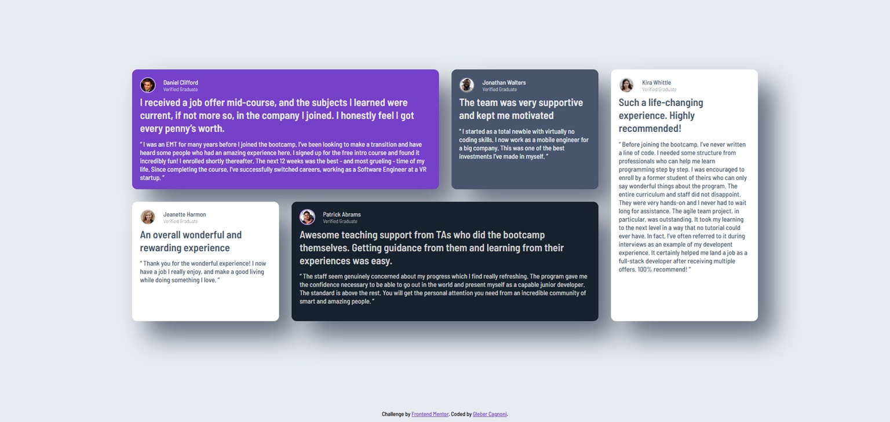

# Frontend Mentor - Testimonials grid section solution

This is a solution to the [Testimonials grid section challenge on Frontend Mentor](https://www.frontendmentor.io/challenges/testimonials-grid-section-Nnw6J7Un7). Frontend Mentor challenges help you improve your coding skills by building realistic projects. 

## Table of contents

- [Overview](#overview)
  - [The challenge](#the-challenge)
  - [Screenshot](#screenshot)
  - [Links](#links)
- [My process](#my-process)
  - [Built with](#built-with)
  - [What I learned](#what-i-learned)
  - [Continued development](#continued-development)

- [Author](#author)

## Overview

### The challenge

Users should be able to:

- View the optimal layout for the site depending on their device's screen size

### Screenshot



### Links

- Solution URL: [Testimonial Github](https://github.com/GleberC/testimonials)
- Live Site URL: [Testimonial Vercel](https://testimonials-umber-rho.vercel.app/)

## My process

### Built with

- Semantic HTML5 markup
- CSS custom properties
- Flexbox
- CSS Grid
- Mobile-first workflow
- Javascript

### What I learned

I used semantic HTML concepts, CSS Flexbox, and CSS Grid to lay out the testimonials. I also utilized JavaScript concepts to highlight each testimonial, with the goal of practicing JavaScript programming.

To see how you can add code snippets, see below:

```html
 <section class="testimonial" id="daniel" data-id="daniel">

      <div class="personal">
        
        <div class="identity">
          <h3 class="name">
            Daniel Clifford
          </h3>
          <p class="gaduation">
            Verified Graduate
          </p>
        </div>
  
      </div>
      <article class="impression">
        I received a job offer mid-course, and the subjects I learned were current, if not more so,
        in the company I joined. I honestly feel I got every penny’s worth.
      </article>
      <blockquote class="detail">
        “ I was an EMT for many years before I joined the bootcamp. I’ve been looking to make a
        transition and have heard some people who had an amazing experience here. I signed up
        for the free intro course and found it incredibly fun! I enrolled shortly thereafter.
        The next 12 weeks was the best - and most grueling - time of my life. Since completing
        the course, I’ve successfully switched careers, working as a Software Engineer at a VR startup. ”
      </blockquote>
    </section>
```
```css
body {
    background-color: var(--Grey-100);
    display: flex;
    flex-direction: column;
    align-items: center;
    padding: 10px;
    font-family: "Barlow Semi Condensed", sans-serif;
    font-weight: 500;
}

.grid_container {
        width: 100%;
        max-width: 1200px; 
        margin: auto; 
        display: grid;
        grid-template-columns: repeat(4, 1fr); 
        grid-auto-rows: 1fr;  
        
        align-self: stretch;
        justify-self: stretch;
        gap: 1.5rem;
    }
```
```js
document.querySelectorAll('.testimonial').forEach((card) => {
  card.addEventListener('click', () => {
    modal.classList.remove('hidden');
    modalContent.innerHTML = card.innerHTML;
  });
});

```
### Continued development

I continue practicing JS to solidify programming concepts in the language.

## Author

- Website - [GleberC](https://github.com/GleberC)
- Frontend Mentor - [GleberC](https://www.frontendmentor.io/profile/GleberC)
